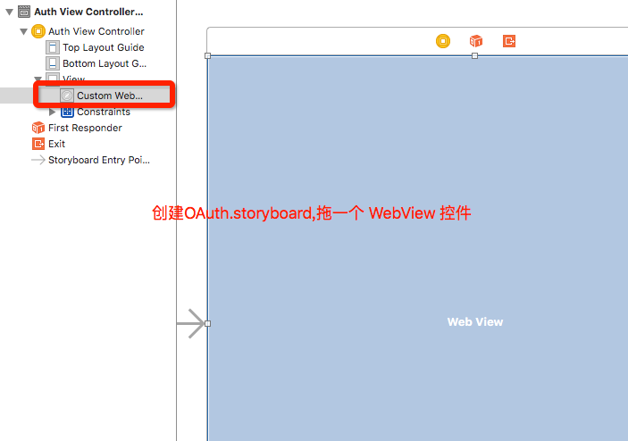

#  获取OAuth授权换取AccessToken全过程

---
```objc
Update更新：2016年6月6日 By {MISSAJJ琴瑟静听} 
```


###创建OAuth授权界面
- OAuth.storyboard




###跳转授权界面
```Swift
/// 监听登录按钮点击
@objc private func loginBtnClick(btn: UIButton)
{
// 1.创建登录界面
let sb = UIStoryboard(name: "OAuth", bundle: nil)
let vc = sb.instantiateInitialViewController()!
// 2.弹出登录界面
presentViewController(vc, animated: true, completion: nil)
}

```


###开始进行OAuth授权

```Swift 
// OAuthViewController.swift 

import UIKit

class OAuthViewController: UIViewController {

/// 网页容器
@IBOutlet weak var customWebView: UIWebView!

override func viewDidLoad() {
super.viewDidLoad()
// 1.定义字符串保存登录界面URL
let urlStr = "https://api.weibo.com/oauth2/authorize?client_id=你的应用ID号&redirect_uri=http://www.missajj.com"
// 2.创建URL
guard let url = NSURL(string: urlStr) else
{
return
}
// 3.创建Request
let request = NSURLRequest(URL: url)

// 4.加载登录界面
customWebView.loadRequest(request)
}

}

```


###获取RequestToken

通过 WebView 代理方法获取返回值
```Swift
extension OAuthViewController: UIWebViewDelegate
{
// 该方法每次请求都会调用
// 如果返回false代表不允许请求, 如果返回true代表允许请求
func webView(webView: UIWebView, shouldStartLoadWithRequest request: NSURLRequest, navigationType: UIWebViewNavigationType) -> Bool {
/*
登录界面: https://api.weibo.com/oauth2/authorize?client_id=你的应用ID号&redirect_uri=http://www.missajj.com 
输入账号密码之后: https://api.weibo.com/oauth2/authorize
取消授权: http://www.missajj.com/?error_uri=%2Foauth2%2Fauthorize&error=access_denied&error_description=user%20denied%20your%20request.&error_code=21330
授权:http://www.missajj.com/?code=c2796542e264da89367f993131e6c904
通过观察
1.如果是授权成功获取失败都会跳转到授权回调页面
2.如果授权回调页面包含code=就代表授权成功, 需要截取code=后面字符串
3.而且如果是授权回调页面不需要显示给用户看, 返回false
*/
// 1.判断当前是否是授权回调页面
guard let urlStr = request.URL?.absoluteString else
{
return false
}

//注意网址后要加一个斜杠/
if !urlStr.hasPrefix("http://www.missajj.com/") 
{
NJLog("不是授权回调页面")
return true
}

NJLog("是授权回调页面")
// 2.判断授权回调地址中是否包含code=
// URL的query属性是专门用于获取URL中的参数的, 可以获取URL中?后面的所有内容
let key = "code="
if urlStr.containsString(key)
{
let code = request.URL!.query?.substringFromIndex(key.endIndex)
NJLog(code)
//加载AccessToken
loadAccessToken(code)
return false
}
NJLog("授权失败")
return false
}
}
```


###利用RequestToken换取AccessToken

- 创建NetworkTools.swift类,统一管理网络请求


``` Swift 
// NetworkTools.swift 

import UIKit
import AFNetworking

class NetworkTools: AFHTTPSessionManager {

// Swift推荐我们这样编写单例
static let shareInstance: NetworkTools = {

// 注意: baseURL后面一定更要写上./
let baseURL = NSURL(string: "https://api.weibo.com/")!

let instance = NetworkTools(baseURL: baseURL, sessionConfiguration: NSURLSessionConfiguration.defaultSessionConfiguration())

instance.responseSerializer.acceptableContentTypes = NSSet(objects:"application/json", "text/json", "text/javascript", "text/plain") as Set 
return instance
}()

}

```

- 利用RequestToken换取AccessToken


```Swift
// 利用RequestToken换取AccessToken
private func loadAccessToken(codeStr: String?)
{
guard let code = codeStr else
{
return
}
// 注意:redirect_uri必须和开发中平台中填写的一模一样
// 1.准备请求路径
let path = "oauth2/access_token"
// 2.准备请求参数{字典}
let parameters = ["client_id": "你的应用 ID 号", "client_secret": "98392a5714c6194f5aee796d971fe0ef", "grant_type": "authorization_code", "code": code, "redirect_uri": "http://www.missajj.com"]
// 3.发送POST请求
NetworkTools.shareInstance.POST(path, parameters: parameters, success: { (task: NSURLSessionDataTask, dict: AnyObject) -> Void in

NJLog(dict)
/*
通过观察, 发现同一个用户对同一个应用程序授权多次返回的AccessToken是一样的, 所有没必要让用户每次都登陆
"access_token" = "2.00SqDL_CwDDUVE081a4819811oPyhC";
{
"access_token" = "2.00SqDL_CwDDUVE081a4819811oPyhC";
"expires_in" = 157679999;
"remind_in" = 157679999;
uid = 2xxxxxx52430;
}
*/

let account = UserAccount(dict: objc as! [String : AnyObject])
//保存用户账户信息
NJLog(account.saveAccount())


}) { (task: NSURLSessionDataTask?, error: NSError) -> Void in
NJLog(error)
}
}
```

###保存用户账户信息

- 创建用户信息类UserAccount.swift

```Swift 
// UserAccount.swift 

import UIKit

class UserAccount: NSObject, NSCoding {

var access_token: String?
var expires_in: Int = 0
var uid: String?

// MARK: - 生命周期方法
init(dict: [String: AnyObject])
{
super.init()
// 如果要想初始化方法中使用KVC必须先调用super.init初始化对象
// 如果属性是基本数据类型, 那么建议不要使用可选类型, 因为基本数据类型的可选类型在super.init()方法中不会分配存储空间
self.setValuesForKeysWithDictionary(dict)
}

// 当KVC发现没有对应的key时就会调用
override func setValue(value: AnyObject?, forUndefinedKey key: String) {

}
override var description: String {
return "abc"
}

// MARK: - 外部控制方法
// 归档模型
func saveAccount() -> Bool
{
// 1.获取缓存目录的路径
let path = NSSearchPathForDirectoriesInDomains(NSSearchPathDirectory.CachesDirectory, NSSearchPathDomainMask.UserDomainMask, true).last!
// 2.生成缓存路径
let filePath = (path as NSString).stringByAppendingPathComponent("useraccount.plist")
NJLog(filePath)
// 3.归档对象
return NSKeyedArchiver.archiveRootObject(self, toFile: filePath)
}

/// 定义属性保存授权模型
static var account: UserAccount?
// 解归档模型
class func loadUserAccount() -> UserAccount?
{
// 1.判断是否已经加载过了
if UserAccount.account != nil{
NJLog("已经有加载过")
// 直接返回
return UserAccount.account
}

// 2.尝试从文件中加载
NJLog("还没有加载过")
// 1.获取缓存目录的路径
let path = NSSearchPathForDirectoriesInDomains(NSSearchPathDirectory.CachesDirectory, NSSearchPathDomainMask.UserDomainMask, true).last!
// 2.生成缓存路径
let filePath = (path as NSString).stringByAppendingPathComponent("useraccount.plist")
// 3.解归档对象
guard let account = NSKeyedUnarchiver.unarchiveObjectWithFile(filePath) as? UserAccount else
{
return UserAccount.account
}
UserAccount.account = account

return UserAccount.account
}

/// 判断用户是否登录
class func isLogin() -> Bool {
return UserAccount.loadUserAccount() != nil
}

// MARK: - NSCoding
func encodeWithCoder(aCoder: NSCoder)
{
aCoder.encodeObject(access_token, forKey: "access_token")
aCoder.encodeInteger(expires_in, forKey: "expires_in")
aCoder.encodeObject(uid, forKey: "uid")
}

required init?(coder aDecoder: NSCoder)
{
self.access_token = aDecoder.decodeObjectForKey("access_token") as? String
self.expires_in = aDecoder.decodeIntegerForKey("expires_in") as Int
self.uid = aDecoder.decodeObjectForKey("uid") as? String
}
}


```