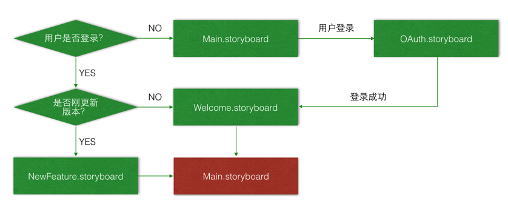

#  检查版本更新

###界面切换流程



###判断是否有新版本

```swift
/// 判断是否有新版本
    private func isNewVersion() -> Bool
    {
        // 1.加载info.plist
        // 2.获取当前软件的版本号
        let currentVersion = NSBundle.mainBundle().infoDictionary!["CFBundleShortVersionString"] as! String
        // 3.获取以前的软件版本号?
        let defaults = NSUserDefaults.standardUserDefaults()
        let sanboxVersion = (defaults.objectForKey("sanboxVersion") as? String) ?? "0.0"
        // 4.用当前的版本号和以前的版本号进行比较
        // 1.0  0.0
        if currentVersion.compare(sanboxVersion) == NSComparisonResult.OrderedDescending
        {
            // 如果当前的大于以前的, 有新版本
            NJLog("有新版本")
            // 如果有新版本, 就利用新版本的版本号更新本地的版本号
            
            defaults.setObject(currentVersion, forKey: "sanboxVersion")
            defaults.synchronize() // iOS7以前需要写, iOS7以后不用写
            return true
        }
        NJLog("没有新版本")
        return false
    }


```
###通过注册和监听,切换根控制器

```Swift
 
 //注册监听
        NSNotificationCenter.defaultCenter().addObserver(self, selector: Selector("changeRootViewController:"), name: MASwitchRootViewController, object: nil)
        
//移除监听        
    deinit
    {
        NSNotificationCenter.defaultCenter().removeObserver(self)
    }        
```
```Swift
/// 切换根控制器的通知
let MASwitchRootViewController =  "MASwitchRootViewController"

```

###切换根控制器

```swift
 /// 切换根控制器
    func changeRootViewController(notice: NSNotification)
    {
        if notice.object as! Bool
        {
            let sb = UIStoryboard(name: "Main", bundle: nil)
            window?.rootViewController = sb.instantiateInitialViewController()!
        }else
        {
            let sb = UIStoryboard(name: "Welcome", bundle: nil)
            window?.rootViewController = sb.instantiateInitialViewController()!
        }
    }
```


###返回默认界面

```swift
    /// 用于返回默认界面
    private func defaultViewController() -> UIViewController
    {
        // 1.判断是否登录
        if UserAccount.isLogin()
        {
            // 2.判断是否有新版本
 
            if isNewVersion()
            {
                let sb = UIStoryboard(name: "Newfeature", bundle: nil)
                return sb.instantiateInitialViewController()!
            }else
            {
                let sb = UIStoryboard(name: "Welcome", bundle: nil)
                return sb.instantiateInitialViewController()!
            }
        }
        
        // 没有登录
        let sb = UIStoryboard(name: "Main", bundle: nil)
        return sb.instantiateInitialViewController()!
    }

```

###完整代码

```swift 
//  AppDelegate.swift 

import UIKit

@UIApplicationMain

 
class AppDelegate: UIResponder, UIApplicationDelegate {

    var window: UIWindow?

   
    func application(application: UIApplication, didFinishLaunchingWithOptions launchOptions: [NSObject: AnyObject]?) -> Bool {
        
        // 一般情况下设置全局性的属性, 最好放在AppDelegate中设置, 这样可以保证后续所有的操作都是设置之后的操作
        // 1.设置外观
        UINavigationBar.appearance().tintColor = UIColor.orangeColor()
        UITabBar.appearance().tintColor = UIColor.orangeColor()
        
        // 2.注册监听
        NSNotificationCenter.defaultCenter().addObserver(self, selector: Selector("changeRootViewController:"), name: MASwitchRootViewController, object: nil)
        
        window = UIWindow(frame: UIScreen.mainScreen().bounds)
        window?.backgroundColor = UIColor.whiteColor()
        window?.rootViewController = defaultViewController()
        window?.makeKeyAndVisible()
         
        return true
    }
    deinit
    {
        NSNotificationCenter.defaultCenter().removeObserver(self)
    }
}

extension AppDelegate
{
    /// 切换根控制器
    func changeRootViewController(notice: NSNotification)
    {
        if notice.object as! Bool
        {
            let sb = UIStoryboard(name: "Main", bundle: nil)
            window?.rootViewController = sb.instantiateInitialViewController()!
        }else
        {
            let sb = UIStoryboard(name: "Welcome", bundle: nil)
            window?.rootViewController = sb.instantiateInitialViewController()!
        }
    }
    
    /// 用于返回默认界面
    private func defaultViewController() -> UIViewController
    {
        // 1.判断是否登录
        if UserAccount.isLogin()
        {
            // 2.判断是否有新版本 
            if isNewVersion()
            {
                let sb = UIStoryboard(name: "Newfeature", bundle: nil)
                return sb.instantiateInitialViewController()!
            }else
            {
                let sb = UIStoryboard(name: "Welcome", bundle: nil)
                return sb.instantiateInitialViewController()!
            }
        }
        
        // 没有登录
        let sb = UIStoryboard(name: "Main", bundle: nil)
        return sb.instantiateInitialViewController()!
    }
    
    /// 判断是否有新版本
    private func isNewVersion() -> Bool
    {
        // 1.加载info.plist
        // 2.获取当前软件的版本号
        let currentVersion = NSBundle.mainBundle().infoDictionary!["CFBundleShortVersionString"] as! String
        // 3.获取以前的软件版本号?
        let defaults = NSUserDefaults.standardUserDefaults()
        let sanboxVersion = (defaults.objectForKey("sanboxVersion") as? String) ?? "0.0"
        // 4.用当前的版本号和以前的版本号进行比较
        // 1.0  0.0
        if currentVersion.compare(sanboxVersion) == NSComparisonResult.OrderedDescending
        {
            // 如果当前的大于以前的, 有新版本
            MALog("有新版本")
            // 如果有新版本, 就利用新版本的版本号更新本地的版本号
            
            defaults.setObject(currentVersion, forKey: "sanboxVersion")
            defaults.synchronize() // iOS7以前需要写, iOS7以后不用写
            return true
        }
        MALog("没有新版本")
        return false
    }
}

```

###WelcomeViewController调用优化
- 将原来的跳转到首页的代码, 改为发送通知

```swift
 override func viewDidAppear(animated: Bool) {
        super.viewDidAppear(animated)
        
        // 1.让头像执行动画
        iconBottomCons.constant = (UIScreen.mainScreen().bounds.height - iconBottomCons.constant)
        
        UIView.animateWithDuration(2.0, animations: { () -> Void in
            self.view.layoutIfNeeded()
            }) { (_) -> Void in
                
                UIView.animateWithDuration(2.0, animations: { () -> Void in
                    self.titleLabel.alpha = 1.0
                    }, completion: { (_) -> Void in
                       
                        // 跳转到首页
                        /*
                        let sb = UIStoryboard(name: "Main", bundle: nil)
                        let vc = sb.instantiateInitialViewController()!
                        UIApplication.sharedApplication().keyWindow?.rootViewController = vc
                        */
                        NSNotificationCenter.defaultCenter().postNotificationName(MASwitchRootViewController, object: true)
                })
        }
    }

```